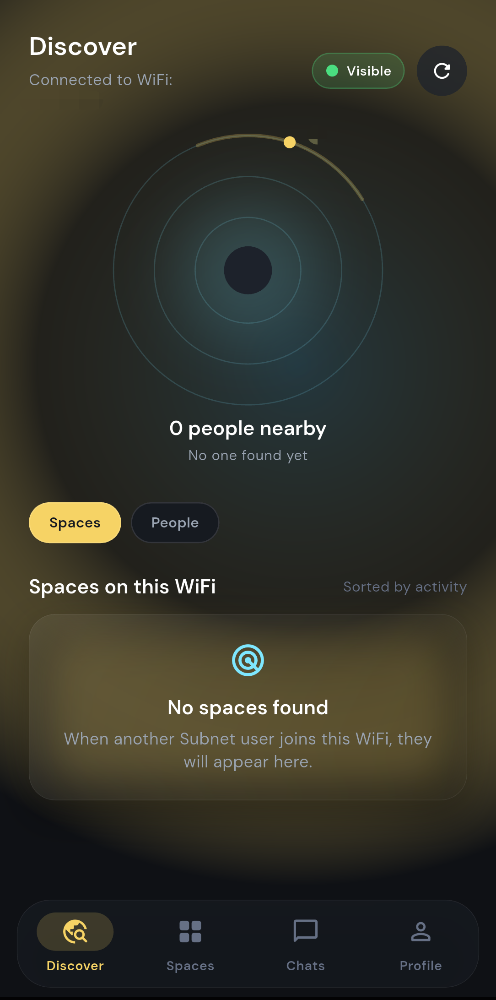
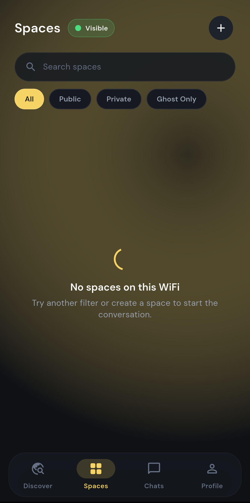
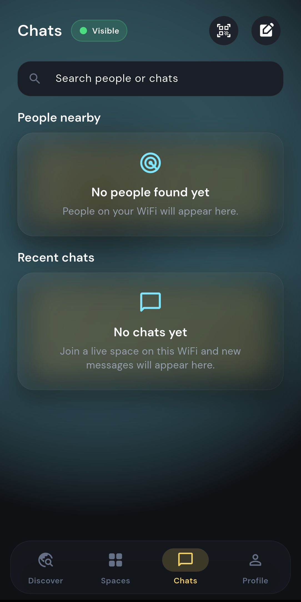
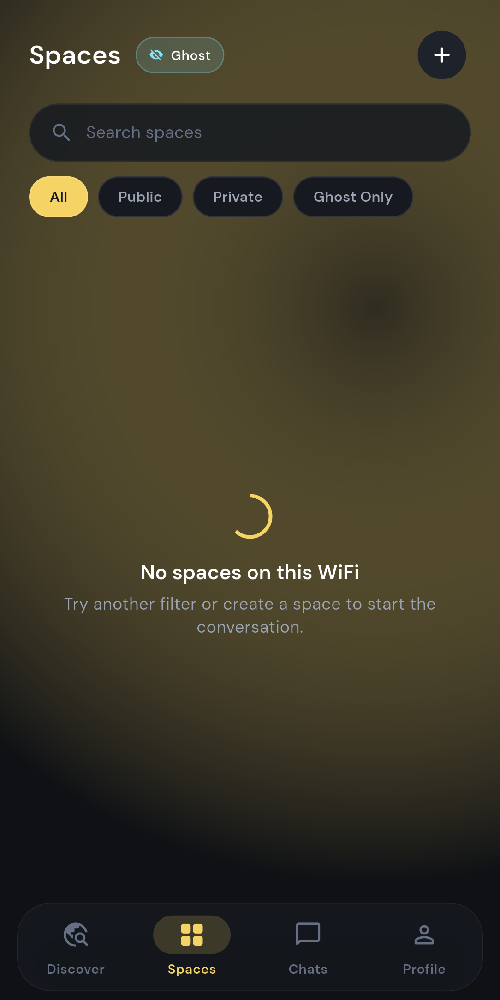
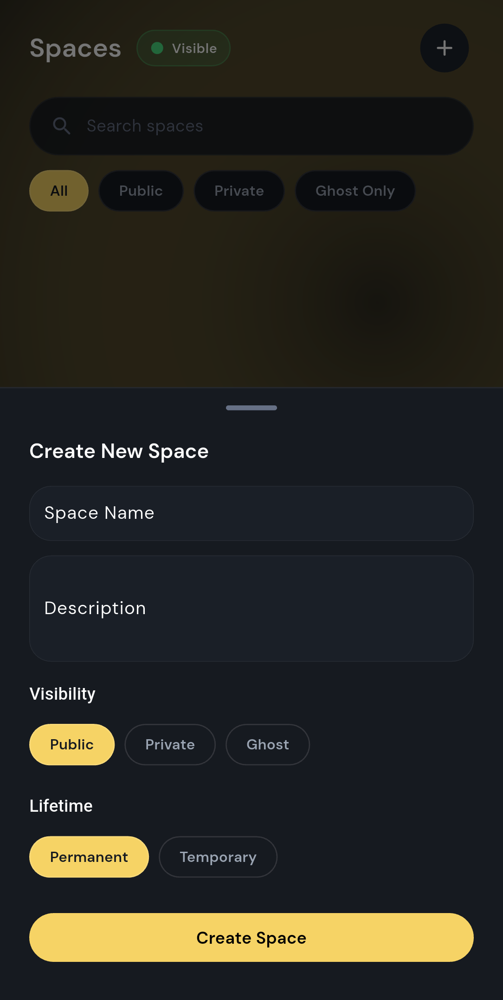
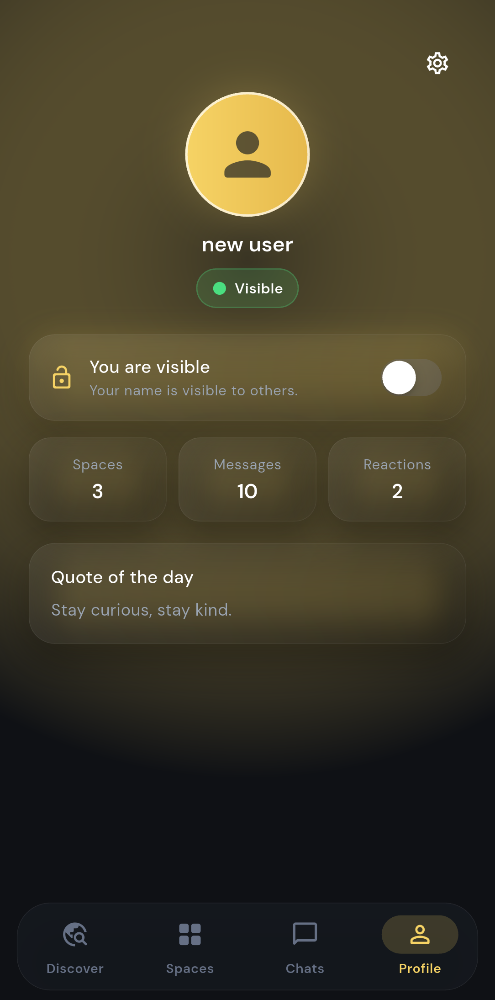
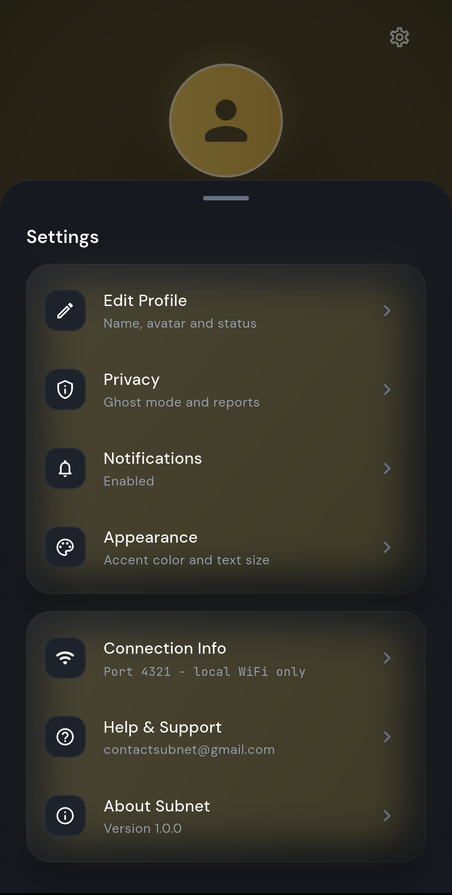
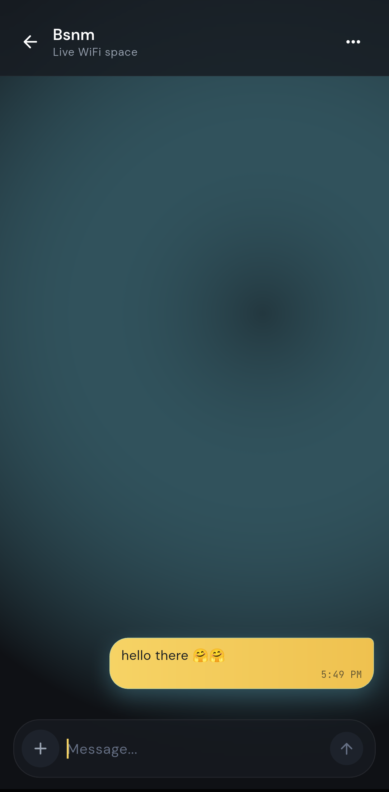

# 🌐 Subnet — Local WiFi Chat App

<div align="center">

**A premium local WiFi chat app built with Flutter. Hidden in your network.**

[](https://flutter.dev)
[](https://dart.dev)
[](LICENSE)
[](pubspec.yaml)

[Features](#-features) • [Installation](#-installation) • [Screenshots](#-screenshots) • [Tech Stack](#-tech-stack) • [Building](#-building--running) • [Contributing](#-contributing)

</div>

---

## 📋 Overview

**Subnet** is a peer-to-peer local WiFi chat application that creates a social layer inside the network you're already connected to. Discover nearby users, create hosted spaces, and chat in real-time over your local network—all without a cloud backend, accounts, or external servers.

Perfect for:
- Connecting with people on the same WiFi network
- Quick team communication in offices, cafes, colleges, hostels or events
- Privacy-conscious local communication
- Exploring peer-to-peer networking

### Key Philosophy
> **No accounts. No cloud backend. No external chat server.**  
> Just local network magic in your hands.

---

## ✨ Features

### 🔍 Peer Discovery
- **WiFi Network Detection**: Displays the current connected WiFi name (with proper Android permissions)
- **mDNS/NSD Service Discovery**: Automatically discovers other Subnet users and spaces on the same WiFi
- **Real-time Updates**: Stream of discovered peers updates as devices join/leave the network
- **Empty State Handling**: Honest UI showing when no other users are available

### 🏘️ Spaces
- **Create Hosted Spaces**: Host a chat room directly from your device
- **Local Advertisement**: Your space is advertised via NSD so others can find it
- **Live Discovery**: Other users see and can join your spaces instantly
- **Session Management**: Real-time user count and active participant tracking

### 💬 Real-time Chat
- **P2P Messaging**: Send and receive messages over local TCP connections
- **Session-based Chat**: Messages exist for the current WiFi session only
- **Rich Interactions**: Long-press messages for reply, copy, and report options
- **Message Timestamps**: Optional timestamp display controlled via settings
- **Typing Indicators**: See when others are typing
- **Smooth Animations**: Material 3 inspired transitions and effects

### 👻 Ghost Mode
- **Anonymous Identity**: Generate random ghost aliases (e.g., `ghost_1447`)
- **Named Identity**: Choose any display name you prefer
- **Toggle Anytime**: Switch between modes instantly from your profile
- **Local-only Storage**: Identity data never leaves your device

### ⚙️ Profile & Settings
- **Customizable Profile**: Edit display name and manage Ghost Mode
- **Appearance Settings**: 
  - Accent color customization
  - Text size adjustment
  - Theme preferences
- **Notification Control**: Sound and vibration preferences
- **Session Stats**: View your hosted space count and message history
- **Help & Support**: Direct contact at `contactsubnet@gmail.com`

---

## 📸 Screenshots

<div align="center">

| Discovery | Spaces | Chat |
|-----------|--------|------|
|  |  |  |

| Ghost Mode | Create Space | Profile | Settings |
|-----------|------|---------|----------|
|  |  |  |  |

| Chatting |
|--------|
|  |

</div>

---

## 🛠️ Tech Stack

| Layer | Technology | Purpose |
|-------|-----------|---------|
| **Framework** | Flutter | Cross-platform iOS & Android |
| **Language** | Dart 3.7.2+ | Primary development language |
| **State Management** | Riverpod | Reactive dependency injection |
| **Local Storage** | Hive | Lightning-fast local database |
| **UI Framework** | Material 3 | Modern design system |
| **Network Discovery** | nsd | mDNS service discovery |
| **Messaging** | dart:io | Raw TCP sockets for P2P |
| **WiFi Info** | network_info_plus | Get connected network details |
| **Permissions** | permission_handler | Runtime permission management |
| **Fonts** | google_fonts | DM Sans & JetBrains Mono |
| **Animations** | flutter_animate | Smooth UI transitions |
| **Device Info** | device_info_plus | Detect device capabilities |

---

## 📦 Installation

### Prerequisites
- Flutter 3.7.2 or higher
- Dart 3.7.2 or higher
- Android SDK 21+ (for Android)
- Xcode 14+ (for iOS)

### From Source

```bash
# Clone the repository
git clone https://github.com/brightrex/subnet.git
cd subnet

# Install dependencies
flutter pub get

# Run on Android
flutter run -d android

# Run on iOS
flutter run -d ios

# Build APK
flutter build apk --release

# Build iOS App
flutter build ios --release
```

### Download APK

Get the latest prebuilt APK from [Releases](https://github.com/brightrex/subnet/releases):

```
release_assets/Subnet-v1.0.0.apk
```

---

## 🚀 Building & Running

### Development Build

```bash
# Install dependencies
flutter pub get

# Generate Hive type adapters (if needed)
flutter pub run build_runner build

# Run on connected device
flutter run

# Run with verbose output
flutter run -v
```

### Production Build

```bash
# Build APK for Android
flutter build apk --release

# Build Android App Bundle
flutter build appbundle --release

# Build iOS App
flutter build ios --release

# Analyze code for issues
flutter analyze

# Run tests
flutter test
```

### Configuration

- **App Icon**: Modify `subnet_app_icon.png` and regenerate using:
  ```bash
  flutter pub run flutter_launcher_icons
  ```

- **App Name**: Update in:
  - `android/app/src/main/AndroidManifest.xml`
  - `ios/Runner/Info.plist`

---

## 🏗️ Project Structure

```
lib/
├── main.dart                 # App entry point
├── models/                   # Data models (messages, peers, spaces)
├── screens/                  # Full-screen UI pages
│   ├── discover_screen.dart
│   ├── spaces_screen.dart
│   ├── chat_screen.dart
│   ├── profile_screen.dart
│   └── settings_screen.dart
├── widgets/                  # Reusable UI components
├── services/                 # Business logic services
│   ├── wifi_discovery_service.dart
│   ├── tcp_messaging_service.dart
│   ├── user_identity_service.dart
│   └── local_storage_service.dart
├── providers/                # Riverpod state providers
├── navigation/               # Route management
└── theme/                    # Material 3 theming
```

---

## 🔐 Privacy & Security

- ✅ **No Cloud**: All data stays on your local network
- ✅ **No Accounts**: No login required, no data collection
- ✅ **No Servers**: Device-to-device communication only
- ✅ **Local Storage**: Settings and identity stored locally with Hive
- ✅ **Session-based**: Messages exist only during WiFi session
- ✅ **Anonymous Option**: Ghost Mode allows truly anonymous participation

> **Note**: Chat messages are not encrypted. Use Subnet on private, trusted networks only.

---

## 🤝 How It Works

### 1. Discovery Phase
- Your device registers itself on the local network using mDNS (Multicast DNS)
- The app discovers other devices running Subnet using NSD
- Available spaces and users appear in real-time

### 2. Connection Phase
- Tap a space or user to initiate connection
- App establishes a direct TCP socket connection
- Connection happens over local WiFi (no internet needed)

### 3. Chat Phase
- Messages are sent as JSON over TCP
- Includes sender ID, display name, message content, and timestamp
- All connected devices in the space receive the message instantly
- No message storage—session-based only

### 4. Identity Management
- Your device gets a permanent UUID (stored locally, never shared)
- You choose a display name or enable Ghost Mode
- Ghost Mode generates random aliases like `ghost_1447`
- No external identity verification needed

---

## ⚙️ Permissions

### Android
- **ACCESS_FINE_LOCATION**: Required for SSID (WiFi name) detection
- **ACCESS_COARSE_LOCATION**: Fallback for network detection
- **CHANGE_NETWORK_STATE**: For WiFi operations
- **READ_PHONE_STATE**: Device identification

### iOS
- **NSLocalNetworkUsageDescription**: For mDNS service discovery
- **NSBonjourServices**: Service advertising
- **NSWifi**: WiFi network information

---

## 📝 Usage Examples

### Create a Space
1. Tap "+" button on Spaces screen
2. Enter space name
3. Share with others on the same WiFi
4. Your space appears in their discovery

### Send a Message
1. Tap a space or discovered user
2. Type your message
3. Hit send—delivered instantly to all connected peers
4. See real-time responses from others

### Toggle Ghost Mode
1. Open your Profile
2. Toggle "Ghost Mode"
3. Choose between anonymous alias or display name
4. Changes apply immediately in active chats

---

## 🐛 Known Limitations

- Messages are not encrypted—use on trusted networks only
- App requires active WiFi connection (not cellular)
- Message history is session-based (cleared on WiFi disconnect)
- Requires Android 5.0+ or iOS 12.0+
- mDNS discovery depends on network configuration

---

## 🚀 Future Roadmap

- [ ] Message encryption (AES-256)
- [ ] Persistent local message history
- [ ] User avatars and profiles
- [ ] Multi-room management
- [ ] Message reactions and emojis
- [ ] Voice message support
- [ ] Windows & macOS desktop clients
- [ ] Web interface for local network access

---

## 🤲 Contributing

We welcome contributions! Here's how:

1. **Fork** the repository
2. **Create** a feature branch (`git checkout -b feature/amazing-feature`)
3. **Commit** your changes (`git commit -m 'Add amazing feature'`)
4. **Push** to the branch (`git push origin feature/amazing-feature`)
5. **Open** a Pull Request

### Guidelines
- Follow Dart style guide: `flutter analyze`
- Format code: `dart format lib/`
- Write tests for new features
- Update README for user-facing changes
- Keep commits atomic and descriptive

---

## 📋 Requirements

### Minimum
- Flutter SDK: ^3.7.2
- Android: API 21+
- iOS: 12.0+

### Dependencies
See [pubspec.yaml](pubspec.yaml) for full dependency list:
- `riverpod: ^2.6.1`
- `hive_flutter: ^1.1.0`
- `nsd: ^5.0.0`
- `network_info_plus: ^7.0.0`
- `permission_handler: ^12.0.1`
- `google_fonts: ^6.3.2`
- And more...

---

## 📄 License

This project is licensed under the **MIT License** — see the [LICENSE](LICENSE) file for details.

---

## 📞 Support & Contact

- **Email**: contactsubnet@gmail.com
- **Issues**: [GitHub Issues](https://github.com/brightrex/subnet/issues)
- **Discussions**: [GitHub Discussions](https://github.com/brightrex/subnet/discussions)
- **Developer**: [@brightrex](https://github.com/brightrex)

---

## 🙏 Acknowledgments

- Built with **Flutter** & **Dart**
- Design inspired by Material 3 and modern app aesthetics
- Peer-to-peer architecture using **mDNS** and **TCP sockets**
- Community feedback and contributions

---

## 📊 Project Stats

- **Language**: Dart
- **Framework**: Flutter
- **Lines of Code**: 5000+
- **Supported Platforms**: Android, iOS
- **License**: MIT
- **Latest Version**: 1.0.0

---

<div align="center">

**Made with ❤️ by the Subnet community**

## 👥 Members/Team
-**sujith**
-**akbar**
-**kishore**
-**adil**

[⬆ back to top](#-subnet--local-wifi-chat-app)

</div>

## Project Structure

```text
lib/
  main.dart
  models/
    message.dart
    peer.dart
  navigation/
    app_page_route.dart
  providers/
    providers.dart
  screens/
    splash_screen.dart
    identity_screen.dart
    main_screen.dart
    room_list_screen.dart
    contacts_screen.dart
    chat_screen.dart
    settings_screen.dart
  services/
    app_settings_service.dart
    report_service.dart
    tcp_messaging_service.dart
    user_identity_service.dart
    wifi_discovery_service.dart
  theme/
    app_colors.dart
    app_theme.dart
    app_typography.dart
  widgets/
    bottom_nav.dart
    frosted_panel.dart
    glass_card.dart
    glow_buttons.dart
```

## Getting Started

### Requirements

- Flutter SDK
- Dart SDK
- Android Studio or Android SDK tools
- Android device or emulator

For LAN discovery and real messaging, test with two physical devices on the same WiFi network. Some emulators do not support multicast discovery reliably.

### Install Dependencies

```bash
flutter pub get
```

### Run Debug Build

```bash
flutter run
```

### Build Debug APK

```bash
flutter build apk --debug
```

Output:

```text
build/app/outputs/flutter-apk/app-debug.apk
```

### Build Release APK

```bash
flutter build apk --release
```

Output:

```text
build/app/outputs/flutter-apk/app-release.apk
```

For GitHub Releases, rename the APK:

```text
Subnet-v1.0.0.apk
```

See [docs/PUBLISHING.md](docs/PUBLISHING.md) for the full GitHub publishing flow.

## Android Permissions

Subnet uses local networking features that require platform permissions:

- Internet access
- Network state
- WiFi state
- Multicast state
- Fine location for WiFi SSID access on Android
- Nearby WiFi devices on newer Android versions

If the WiFi name appears as unknown, grant the requested permissions and make sure location services are enabled.

## Privacy

Subnet is designed around local communication:

- No accounts
- No cloud chat server
- No remote message storage
- Messages travel over the local WiFi/LAN
- Identity and settings are stored locally on the device

Because this is a LAN app, network behavior depends on the WiFi router. Some public or campus networks block peer discovery or device-to-device traffic.

## Known Limitations

- Messages are session-based and are not yet persisted as full chat history.
- Discovery requires devices to be on the same WiFi.
- Some routers block multicast/mDNS discovery.
- Android may hide the WiFi SSID unless location permission and location services are enabled.
- Reaction counts are not fully implemented yet.
- Release signing is not configured in this repo.

## Roadmap

- Persistent chat history
- Real reaction counting
- Stronger room metadata and member lists
- Join/leave events
- Better request flow for private spaces
- File and voice message support
- More complete moderation flow
- Release signing and store-ready build setup

## Useful Commands

```bash
flutter analyze
flutter test
flutter build apk --debug
flutter build apk --release
```

## Support

For feedback or reports, contact:

```text
contactsubnet@gmail.com
```

Developer:

```text
https://github.com/brightrex
```

## License

All rights reserved. See [LICENSE](LICENSE).
